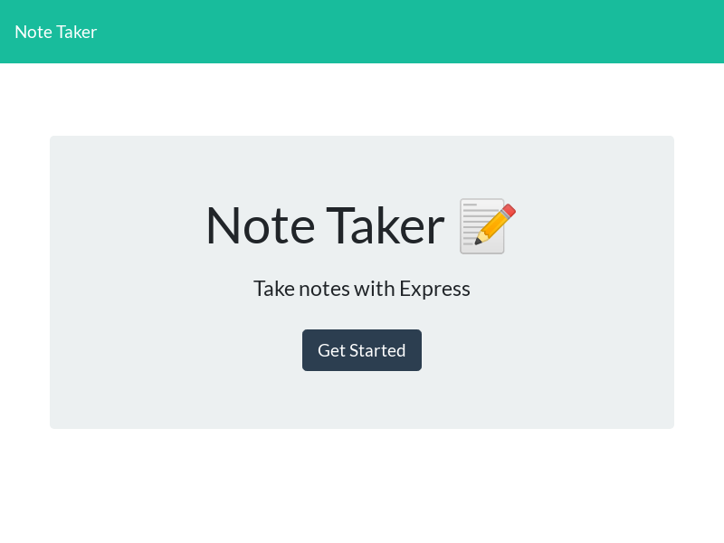
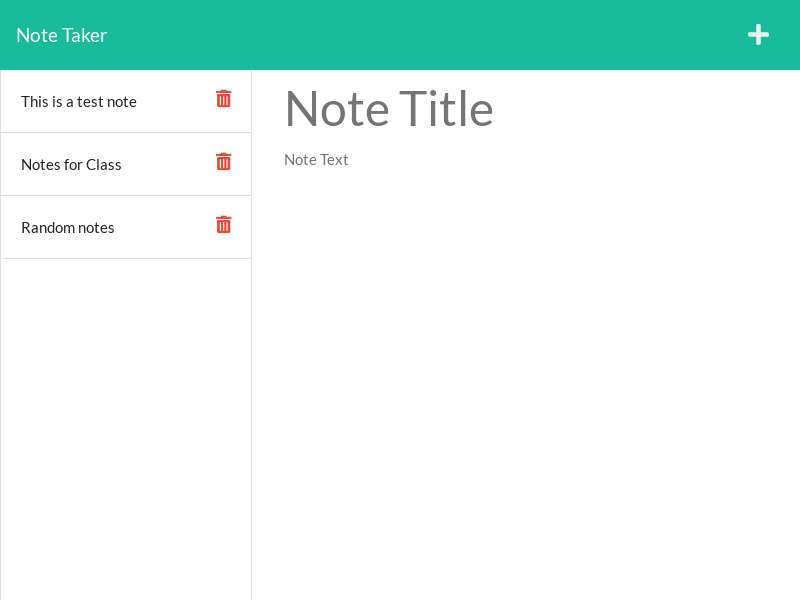

## Note Taker Application

## Heroku deployment
https://ry-note-taker.herokuapp.com/

## GITHUB repo
https://github.com/RudezY/Note-Taker-application

## Screenshots

## Table of Contents 
  [Description](#description) 
  [Installation-Instructions](#installation-instructions) 
  [Usage-Information](#usage) 
  [Testing-Instructions](#tests) 

## The Title of the Application
Note Taker Application

## Description
 This Note Taker application provides you with the ability to create, save and delete notes that will be saved to a database. You are able to recall the notes to view the notes that you have created. 

 ## Installation Instructions
 The application is deployed on Heroku so there is no installation instructions required. It is ready to use.

 ## Usage
 It is a simple note taking application.

 ## Tests
 There are no tests for this application

